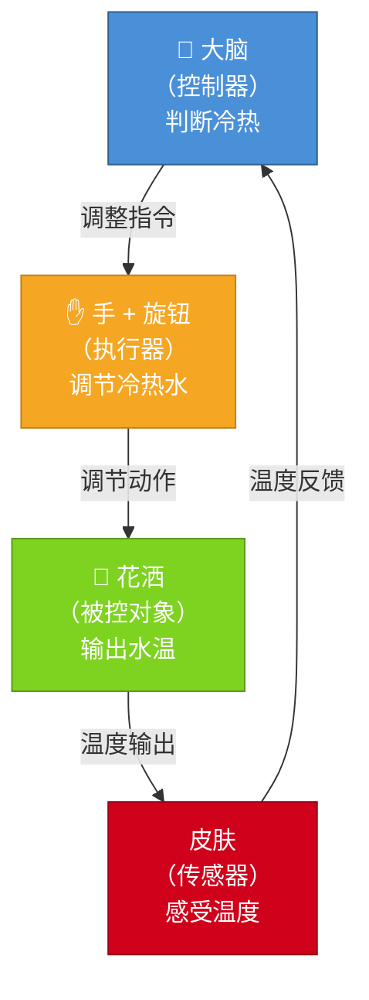
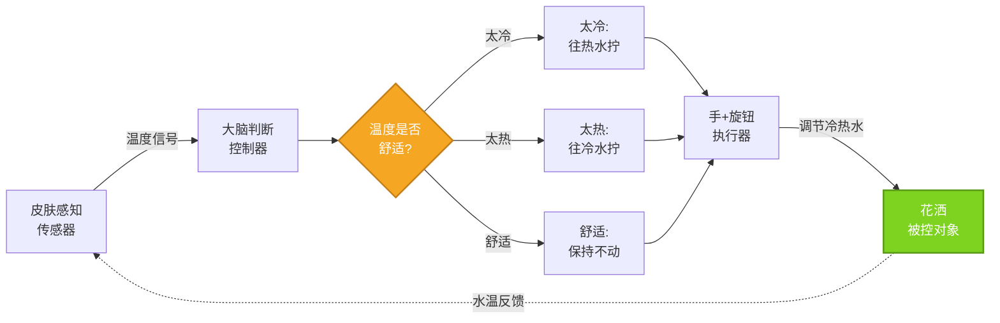

# 洗澡反馈控制系统

## 图1：反馈回路总览

## 图2：控制决策详解

---

## 控制系统四大组成部分

| 组件 | 洗澡例子 | 说明 |
|------|---------|------|
| **被控对象** | 花洒 | 要控制的目标（输出量：水温） |
| **执行器** | 手 + 旋钮 | 执行控制动作的装置 |
| **传感器** | 皮肤 | 检测并反馈当前状态 |
| **控制器** | 大脑 | 根据反馈做出决策 |

## 反馈调节流程

1. **感知**：皮肤感受当前水温（传感器）
2. **判断**：大脑判断温度是否舒适（控制器）
3. **执行**：手转动旋钮调整冷热水比例（执行器）
4. **输出**：花洒输出新的水温（被控对象）
5. **循环**：返回步骤1，持续反馈调节，直到达到舒适温度
